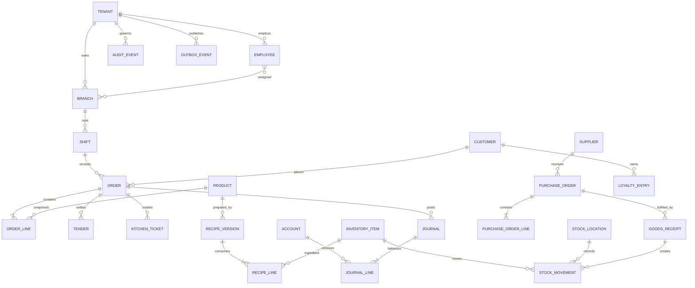

# Conceptual ERP ERD

```mermaid
erDiagram
  TENANT ||--o{ BRANCH : owns
  TENANT ||--o{ EMPLOYEE : employs
  EMPLOYEE }o--o{ BRANCH : assigned
  BRANCH ||--o{ SHIFT : runs
  SHIFT ||--o{ ORDER : records
  CUSTOMER ||--o{ ORDER : places
  ORDER ||--|{ ORDER_LINE : contains
  ORDER ||--o{ TENDER : settles
  ORDER ||--o{ KITCHEN_TICKET : creates
  ORDER ||--o{ JOURNAL : posts
  PRODUCT ||--o{ ORDER_LINE : snapshots
  PRODUCT ||--o{ RECIPE_VERSION : prepared_by
  RECIPE_VERSION ||--|{ RECIPE_LINE : consumes
  INVENTORY_ITEM ||--o{ RECIPE_LINE : ingredient
  INVENTORY_ITEM ||--o{ STOCK_MOVEMENT : moves
  STOCK_LOCATION ||--o{ STOCK_MOVEMENT : records
  SUPPLIER ||--o{ PURCHASE_ORDER : receives
  PURCHASE_ORDER ||--|{ PURCHASE_ORDER_LINE : contains
  PURCHASE_ORDER ||--o{ GOODS_RECEIPT : fulfilled_by
  GOODS_RECEIPT ||--o{ STOCK_MOVEMENT : creates
  ACCOUNT ||--o{ JOURNAL_LINE : receives
  JOURNAL ||--|{ JOURNAL_LINE : balances
  CUSTOMER ||--o{ LOYALTY_ENTRY : owns
  TENANT ||--o{ AUDIT_EVENT : governs
  TENANT ||--o{ OUTBOX_EVENT : publishes
```

The physical schema must add tenant/branch keys, currencies, document references, source IDs and actor/correlation metadata described in `DATABASE_DESIGN.md`.
